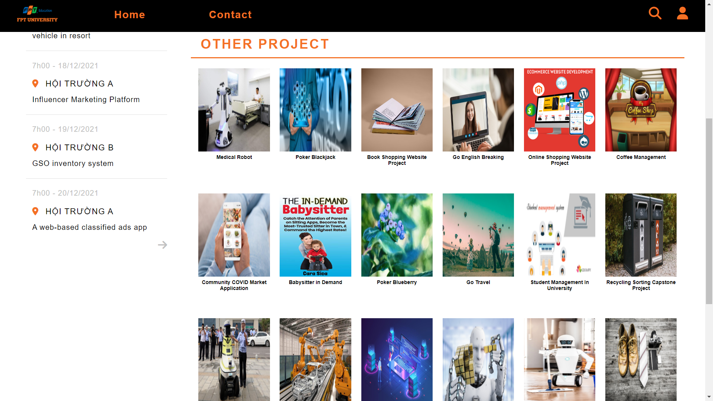
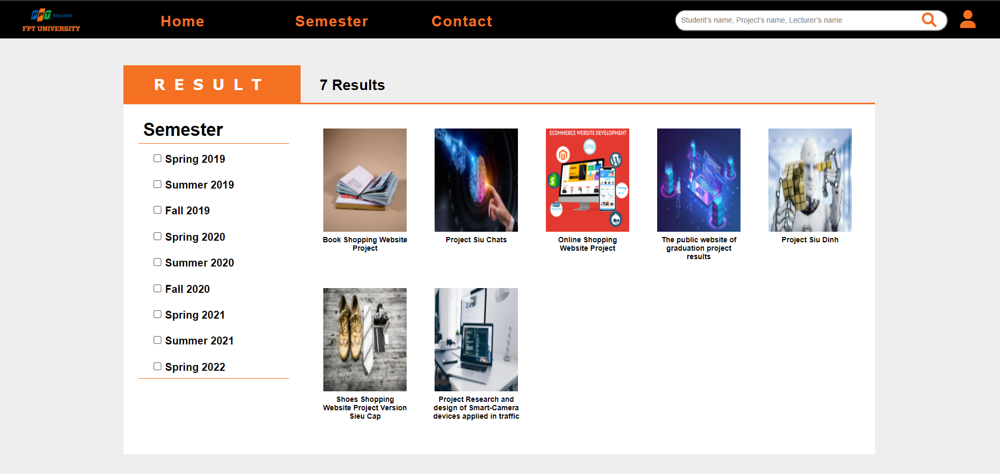
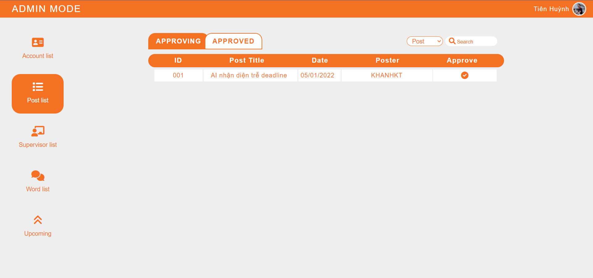
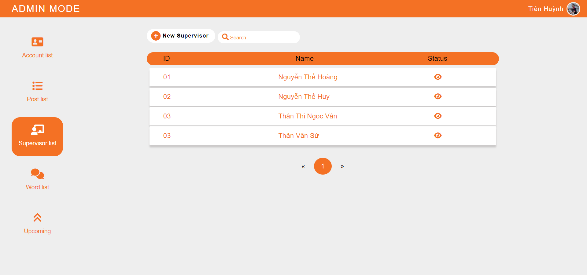
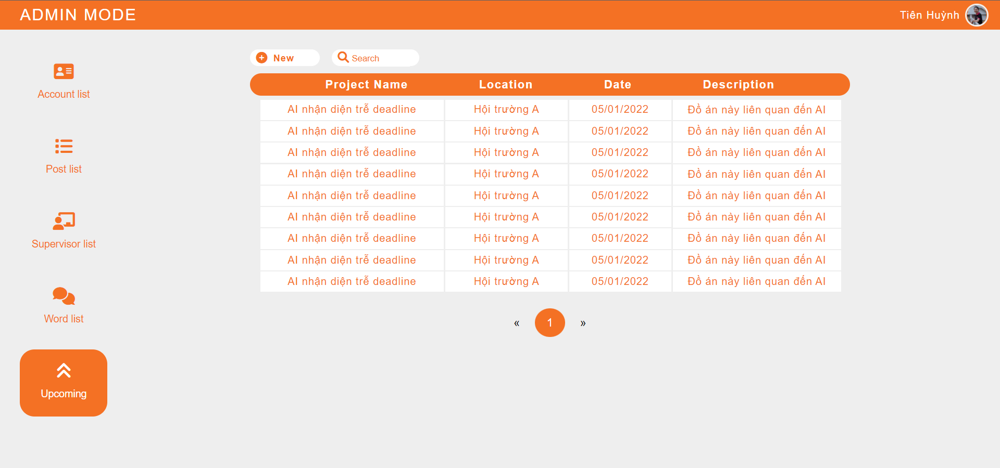
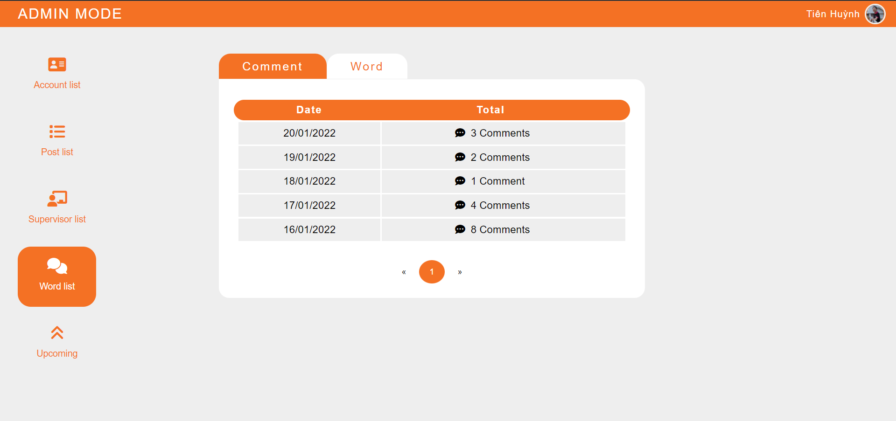

# PUBLISH GRADUATION CAPSTONE WEBAPP

:wave: Welcome to our Software Development Project (SWP391) :wave:

## Table of Contents
- [Description](#description)
- [Preview Screenshot](#preview-screenshot)
- [Technology](#technology)
- [Functional requirements](#functional-requirements)
- [Useful Resources](#useful-resources)
- [Contributors](#contributors)
- [Reference](#reference)
- [License & Copyright](#license--copyright)

## Description
- This is a website to publish the graduation projects of final year students
- This web works well on desktop, not for mobile

## Preview Screenshot

  </img> &nbsp;&nbsp; </img>
  </img> &nbsp;&nbsp; </img>
  </img> &nbsp;&nbsp; </img>
  </img> &nbsp;&nbsp; </img>

  
## Technology
**1. Frontend**
  - HTML, CSS, JavaScript
  - XMLHttpRequest

**2. Backend**
  - Java Language

**3. Database**
  - Microsoft SQL Server - a relational model database server produced by Microsoft
  - Full-Text Search - SQL Server

**4. Other Technologies**
- RESTful API
- Oauth2
- MVC2 Model

**5. Tool**
  - Netbeans 8.2
  - Java JDK 8
  - Apache Tomcat 8.5.29
  - Figma
  - Postman
  - StarUML
  - Visual Studio Code
  - Microsoft SQL Server Management Studio 18

## Functional requirements
**1. Guest:**
- [x] Login by Gmail
- [x] View projects
- [x] Search projects by project's name, supervisor's name, team member's name
- [x] Bookmark favorite project
- [x] Comment in project

**2. Contributor (Team member, suppervior, company)**
- [x] Basic functions of normal users
- [x] Share related to the project
- [x] Post the sharing of the project

**3. Editor (Academic staff)**
- [x] Post basic information of the project such as name, project defense date, member,...

**4. Admin:**
- [x] Approve post from the editor
- [x] Approve shared post the contributor
- [x] Filter comments
- [x] Managing supervisors
- [x] Account Management

## Useful Resources

#| Name | Description
-| ---- | -----------
1| [Main Project Folder](https://github.com/fptu-team-404-not-found/publish-graduation-capstone/tree/main/PublishGraduationCapstone) | -
2| [Database Folder](https://github.com/fptu-team-404-not-found/publish-graduation-capstone/tree/main/database) | -
2.1| [Database Script](https://github.com/fptu-team-404-not-found/publish-graduation-capstone/blob/main/database/ScriptDatabase.sql) | -
2.2| [Database StarUML Model File](https://github.com/fptu-team-404-not-found/publish-graduation-capstone/blob/main/database/SWP391.mdj) | -
2.3| [Database ERD Diagram](https://raw.githubusercontent.com/fptu-team-404-not-found/publish-graduation-capstone/main/imgs/database-ERD.png) | - 
2.4| [Database Diagram](https://raw.githubusercontent.com/fptu-team-404-not-found/publish-graduation-capstone/main/imgs/database-diagram.png) | -
3| [UI Design](https://www.figma.com/file/8bXKMQcuvUHcne1PlG5mlE/Project-Siu-%C4%90%E1%BB%89n?node-id=151%3A368) | -
4| [Library Folder](https://github.com/fptu-team-404-not-found/publish-graduation-capstone/tree/main/lib) | -

## Contributors
- [Tran Ngoc Thang](https://github.com/thangtn2101) - SE151478 - **Leader | Database Designer | Front-end Developer**
- [Nguyen Dao Duc Quan](https://github.com/dq-qiji) - SE151008 - **UI Designer | Front-end Developer**
- [Nguyen Lam Thuy Phuong](https://github.com/nguyenlamthuyphuong25) - 	**SE150999 - UI Designer | Front-end Developer**
- [Huynh Le Thuy Tien](https://github.com/tienhuynh-tn) - SE151104 - **Back-end Developer | Database Designer**
- [Tran Thanh Dat](https://github.com/DatTranLK) - SE151444 - **Back-end Developer**

## Reference

- [Integrating Google Sign-In into your web app]([http://www.kieutrongkhanh.net/2016/08/huong-dan-thuc-hien-chuc-nang-login-vao.html](https://developers.google.com/identity/sign-in/web/sign-in))

## License & Copyright
&copy; 2022 fptu-team-404-not-found Licensed under the [GPL-3.0 LICENSE](https://github.com/fptu-team-404-not-found/publish-graduation-capstone/blob/main/LICENSE).
